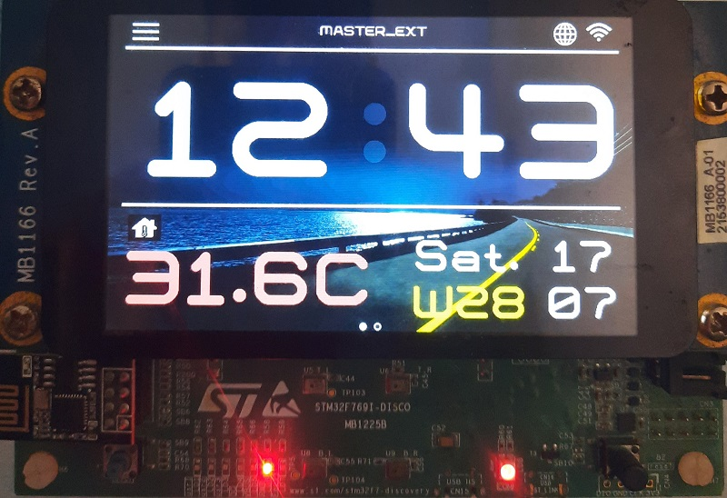

# Meteo status and digital clock
  

# digiital clock Synced with internet

the following project use the STM32F769 discovery board

# Features

* RTC with LSE
* GUI with STemWin
* Connected to WIFI through esp8266
* based on FreeRTOS
* Real Time meteo station
* indoor meteo using the IKS03 extension board

# Hardware

* STM32F769 discovery

# Software

* EWARM 9.5

# Contact

email: maher.mastouri@gmail.com
